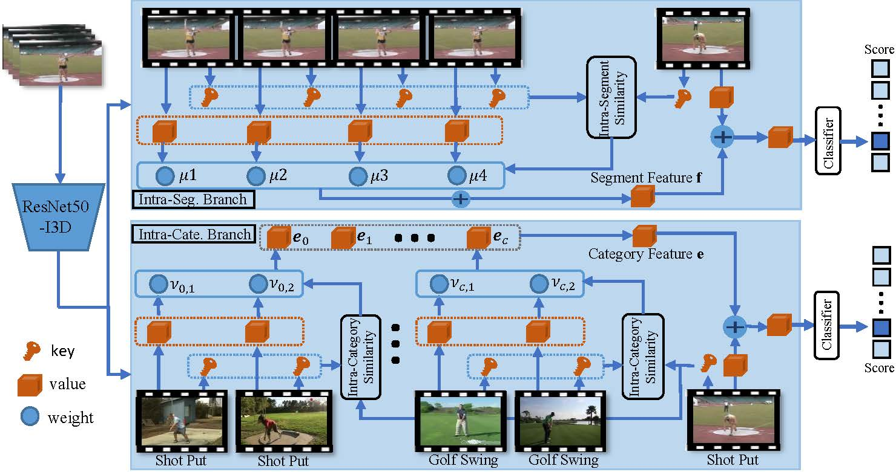

## Colar: Effective and Efficient Online Action Detection by Consulting Exemplars

This repository is the official implementation of Colar. In this work, we study the online action detection. Current works model historical dependencies and anticipate future to perceive the action evolution within a video segment and improve the detection accuracy. However, the existing paradigm ignores category-level modeling and does not pay sufficient attention to efficiency. Considering a category, its representative frames exhibit various characteristics. Thus, the category-level modeling can provide complementary guidance to the temporal dependencies modeling. In this paper, we develop an effective exemplar-consultation mechanism that first measures the similarity between a frame and exemplary frames, and then aggregates exemplary features based on the similarity weights. This is also an efficient mechanism as both similarity measurement and feature aggregation require limited computations. Based on the exemplar-consultation mechanism, the long-term dependencies can be captured by regarding historical frames as exemplars, and the category-level modeling can be achieved by regarding representative frames from a category as exemplars. Due to the complementarity from the category-level modeling, our method employs a lightweight architecture but achieves new high performance on three benchmarks. In addition, using a spatio-temporal network to tackle video frames, our method spends 9.8 seconds to dispose of a one-minute video and achieves comparable performance.` 




## Requirements

a. To install requirements:

```setup
conda env create -n env_name -f environment.yaml
```

Before running the code, please activate this conda environment.

## Data Preparation

a. Enter data directory

	cd data/thumos

b. Download raw annotations and video data

~~~~
bash download.sh
~~~~

c. Extract frames

```
bash extract_frames.sh videos/val frames/val -vf fps=25 -s 224x224 %05d.png
bash extract_frames.sh videos/test frames/test -vf fps=25 -s 224x224 %05d.png
```

## Train & Inference

a. Download  init weight 

You need to download the pre-trained weight [weight_init](https://pan.baidu.com/s/1rj5RfzZjmFYnAVpjGvAYVw)  to initialize network, and Place the model inside the `models` folder.(pwd: czpw)

b. Config

Adjust configurations

`./init.py`

c. Train

```train
python main.py --cuda_id 0
```
d. Test

```eval
python test.py --cuda_id 0 --model '*.pth' 
```
## Pre-trained Models

You can download pretrained models here:

- [THUMOS14_best.pth](https://pan.baidu.com/s/1k8P2lUWLN3t6r2JUSSZb9Q) trained on THUMOS14  (pwd: yd9m)

